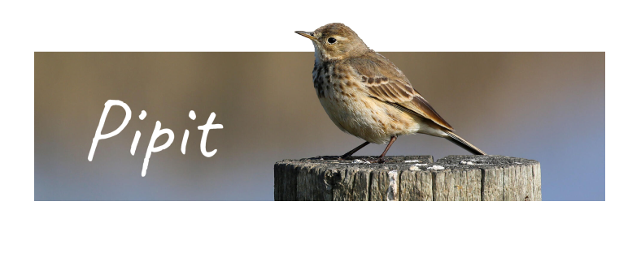

    <a href="https://github.com/smikhalevski/react-executor#readme" title="Asynchronous task execution and state management for React."><picture>
      <source media="(prefers-color-scheme: dark)" srcset="./images/react-executor-dark.png" />
      <source media="(prefers-color-scheme: light)" srcset="./images/react-executor-light.png" />
      
    </picture></a>
    
    
    
    <a href="https://github.com/smikhalevski/react-corsair#readme" title="Because routes are better then URLs."><picture>
      <source media="(prefers-color-scheme: dark)" srcset="./images/react-corsair-dark.png" />
      <source media="(prefers-color-scheme: light)" srcset="./images/react-corsair-light.png" />
      
    </picture></a>
    <a href="https://github.com/smikhalevski/json-marshal#readme" title="JSON serializer that can stringify and parse any data type."><picture>
      <source media="(prefers-color-scheme: dark)" srcset="./images/json-marshal-dark.png" />
      <source media="(prefers-color-scheme: light)" srcset="./images/json-marshal-light.png" />
      
    </picture></a>
    <a href="https://github.com/smikhalevski/doubter#readme" title="Runtime validation and transformation library."><picture>
      <source media="(prefers-color-scheme: dark)" srcset="./images/doubter-dark.png" />
      <source media="(prefers-color-scheme: light)" srcset="./images/doubter-light.png" />
      
    </picture></a>
    
    
    
    
    <a href="https://github.com/smikhalevski/jointly#readme" title="Run multiple processes from a single terminal."><picture>
      <source media="(prefers-color-scheme: dark)" srcset="./images/jointly-dark.png" />
      <source media="(prefers-color-scheme: light)" srcset="./images/jointly-light.png" />
      
    </picture></a>
    <a href="https://github.com/smikhalevski/foxhole#readme" title="Private forward proxy in a couple of clicks."><picture>
      <source media="(prefers-color-scheme: dark)" srcset="./images/foxhole-dark.png" />
      <source media="(prefers-color-scheme: light)" srcset="./images/foxhole-light.png" />
      
    </picture></a>

