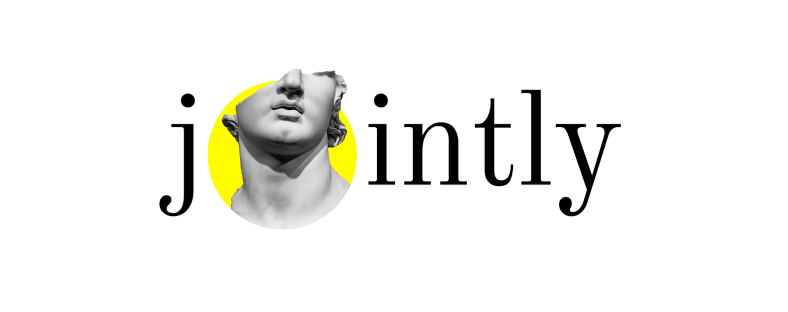

### Hi there 👋

    
    <a href="https://github.com/smikhalevski/doubter#readme"><picture>
      <source media="(prefers-color-scheme: dark)" srcset="./images/doubter-dark.png" />
      <source media="(prefers-color-scheme: light)" srcset="./images/doubter-light.png" />
      
    </picture></a>
    
    
    
    
    
    
    <a href="https://github.com/smikhalevski/jointly#readme"><picture>
      <source media="(prefers-color-scheme: dark)" srcset="./images/jointly-dark.png" />
      <source media="(prefers-color-scheme: light)" srcset="./images/jointly-light.png" />
      
    </picture></a>

